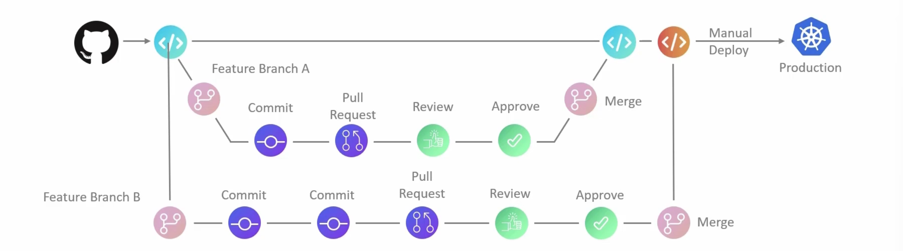

# CI / CD Integration 

## Why we need Continuous Integration 

### Deployed Testing 

Without CI, testing typically occurs late in the deployment cycle, often after multiple merges have taken place. 

### Inefficient Deployment 

In the absence of CI, deploying code to various environments (e.g., staging, production) often relies on manual processes. 

### Quality Assurance Challenges 

Without automated testing, ensuring quality becomes more reliant on manual testing, making it prone to human error. 

