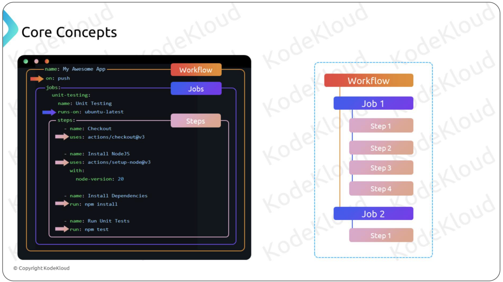
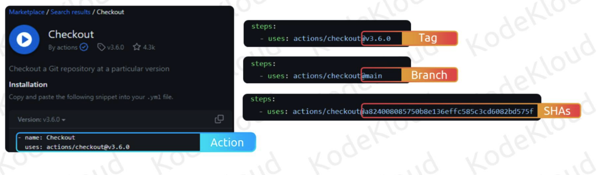

# GitHub Action Core Concepts

There are three core components in GitHub Action. 

## Workflow 
A workflow is an automated process capable of executing one or more jobs. It is widely used in our software developments process, from building and testing code to deploying it to various environments. These workflows are defined using YAML files and are located within your repository. A repository can have multiple workflows, each of which runs response to specific events occuring in our repository. 

## Jobs
Jobs are the building blocks of a workflow, and we can have one or more jobs within a single workflow. Each job is associated with a runner it could be a **GitHub-hosted** or **self-hosted** runner. Each job is associated with a runner it could be a GitHub-hosted or self-hosted runner. We use the runs-on attribute to specify the runner. 

If a workflow has multiple jobs, Jobs can run in parallel or sequentially(if resources allowed), depending on your configuration. 

## Steps 
Steps in GitHub workflows are individual tasks or actions that make up a job. There are executed sequentially within a job's runner environment. Steps can include commands, actions, or scripts, allowing us to automate specific actions like building, testing, or deploying codes as part of our CI/CD process. 

A few examples of official GitHub Actions include: 
- Build & push Docker images -- GitHub Actions forbuilding and pushing docker images. 
- Create AKS cluster -- GitHub Action for creating AKS(Azure Kubernetes Cluster) cluster.
- Vault Secrets -- A GitHub Action that allows us to consume HashiCorp Vault(also the corporation for Terraform Certification) secrets as secure environment variables. 

## What's GitHub Actions?
Actions within GitHub workflows are **pre-built**, **resuable automation components** designed for specific tasks. 
These actions can be created by us or by members of the community, making it easy to share and reuse automation logic across repositories. 

## What Each GitHub Action Includes ? 

We can define the Action's version in three ways: through **tags**, **branches**, or **SHAs**.

- Tags - are useful for deciding when to swtich between major and monior versions. 

- Branches - Specifying a branch for the action means it will always runs the version currently on that branch. 

- SHAs - For more dependable versioning, using the SHA value associated with the Action's version is recommended. **SHAs are immutable, making them a more reliable choice compared to tags or branches.**

