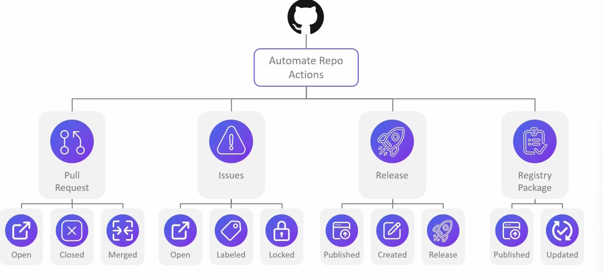

# GitHub-Action-in-Action

__A personal learning & experimentation repo for mastering GitHub Actions, Dockerized microservices, and automated deployments.__

This repository captures my notes, configurations, and hands-on experiments for **end-to-end CI/CD automation** using GitHub Actions.

The final goal is: 

> Build & test isolated frontend and backend services → Push Docker images to JFrog → Prepare for future Kubernetes deployments using ArgoCD/FluxCD.

## Learning Notes Outline 

### Core Concepts 
- GitHub Actions workflow anatomy: jobs, steps, actions. 
- Workflow triggers (push, pull_request, manual dispatch)
- Repository secrets & environment variables
- Job matrices and parallel execution 
- Artifact and cache usage 

### Continuous Integration (CI)
#### Frontend Pipeline
- Install dependencies via npm 
- Run unit tests & BDD tests (e.g., Cucumber.js)
- Build production-ready frontend package 
- Dockerize frontend -> push to JFrog / DockerHub Repo 

#### Backend Pipeline 
- Build & Test with Maven 
- Run BDD tests (e.g., Cucumber-JVM)
- Package backend JAR 
- Dockerize backend -> push to JFrog / DockerHub Repo 

#### CI Features: 
- Parallel build pipelines for frontend & backend 
- Cache npm & Maven dependencies for faster builds 
- Store test reports as workflow artifacts 

### Continuous Deployment (CD)
- Separate dev and prod GitHub Environments 
- Use `kubectl` in workflows to apply manifests
- Replace placeholders with image tags from CI stage
- Trigger ArgoCD/FluxCD to sync deployments
- Secret handling of kubeconfigs & registry credentials 

### BDD Testing Integration 
BDD tests run **before deployment** to ensure user-facing behavior is correct:
- Frontend -> Cucumber.js test suite for UI flows. 
- Backend -> Cucumber-JVM integration tests for API endpoints. 
- Run in isolated Docker Compose test envs. 
- Fail CI pipeline if BDD tests fail. 

### Reusable Workflows & Automation 
- Shared workflows for Docker build & push
- Shared testing workflows for BDD & unit tests
- Slack notifications on build/deploy events

### Security Practices 
- GitHub Secrets for sensitive credentials
- JFrog token-based authentication
- Preventing script injection in workflows
- Vault integration for secret management

## Tools in Use 
- GitHub Actions -> CI/CD engine 
- Docker & Docker Compose -> Build & Test isolated services
- JFrog Artifactory -> Docker Image Registry 
- Kubernetes -> Deployment target 
- ArgoCD/FluxCD -> GitOps deployment tools 
- Maven & npm -> Build tools for backend & frontend 
- Cucumber.js/Cucumber-JVM -> BDD testing frameworks 

## Final Deployment Flow 
